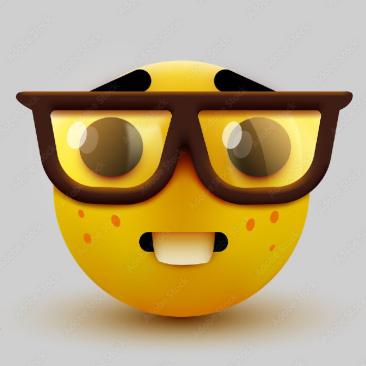

```{container} home-courier




<audio controls>
  <source src="_static/audio/nerd.mp3" type="audio/mpeg">
    浏览器不支持 audio 标签。
</audio>


<br>

This silly page is for showcasing my favorite quotes. So there is a nerd emoji. And also, a funny nerd sound effect. Enjoy. 

<br>

For more infomation, click anywhere in the left index column. This page and my website are still under construction, I am very sorry for myself. Really.


>Evidence is always partial. Facts are not truth, though they are part of it – information is not knowledge. And history is not the past – it is the method we have evolved of organising our ignorance of the past. It’s the record of what’s left on the record. It’s the plan of the positions taken, when we to stop the dance to note them down. It’s what’s left in the sieve when the centuries have run through it – a few stones, scraps of writing, scraps of cloth. It is no more “the past” than a birth certificate is a birth, or a script is a performance, or a map is a journey. It is the multiplication of the evidence of fallible and biased witnesses, combined with incomplete accounts of actions not fully understood by the people who performed them. It’s no more than the best we can do, and often it falls short of that.
>
>― Hilary Mantel

<br>

> Education is the kindling of a flame, not the filling of a vessel.  
> — Socrates


```{toctree}
:hidden:
:maxdepth: 1
:caption: 笔记

notes/heat-capacity
notes/irrep
```

```{toctree}
:hidden:
:maxdepth: 1
:caption: 其他

other/test
```

```